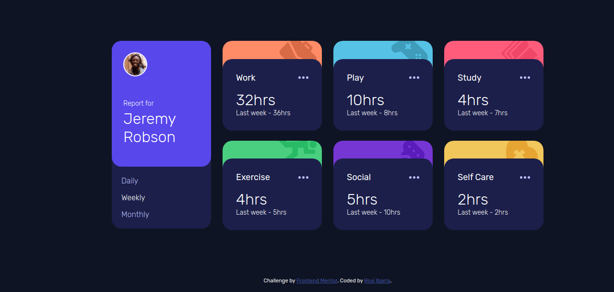

# Frontend Mentor - Time tracking dashboard solution

This is a solution to the [Time tracking dashboard challenge on Frontend Mentor](https://www.frontendmentor.io/challenges/time-tracking-dashboard-UIQ7167Jw). Frontend Mentor challenges help you improve your coding skills by building realistic projects. 

## Table of contents

- [Overview](#overview)
  - [The challenge](#the-challenge)
  - [Screenshot](#screenshot)
  - [Links](#links)
- [My process](#my-process)
  - [Built with](#built-with)
  - [What I learned](#what-i-learned)
  - [Continued development](#continued-development)
  - [Useful resources](#useful-resources)
- [Author](#author)
- [Acknowledgments](#acknowledgments)

**Note: Delete this note and update the table of contents based on what sections you keep.**

### Screenshot

### Links

- Solution URL: [Solution URL](https://github.com/rosialix/Time-tracking-dashboard)
- Live Site URL: [Live Site URL](https://rosialix.github.io/Time-tracking-dashboard/)

## My process
For this challenge start the analysis for Css Grid.
This was my first challenge applying Javascript to develop a page with json reading
For the manipulation of the json, the content of the Frontend contributor Mentor Mikhail Kulikov was of great help.

### Built with

- Semantic HTML5 markup
- CSS custom properties
- Flexbox
- CSS Grid
- Mobile-first workflow
- [React](https://reactjs.org/) - JS library
- [Next.js](https://nextjs.org/) - React framework

## Author

- Frontend Mentor - [@rosialix](https://www.frontendmentor.io/profile/rosialix)

## Acknowledgments

For the manipulation of the json, the content of the Frontend contributor Mentor Mikhail Kulikov was of great help.
